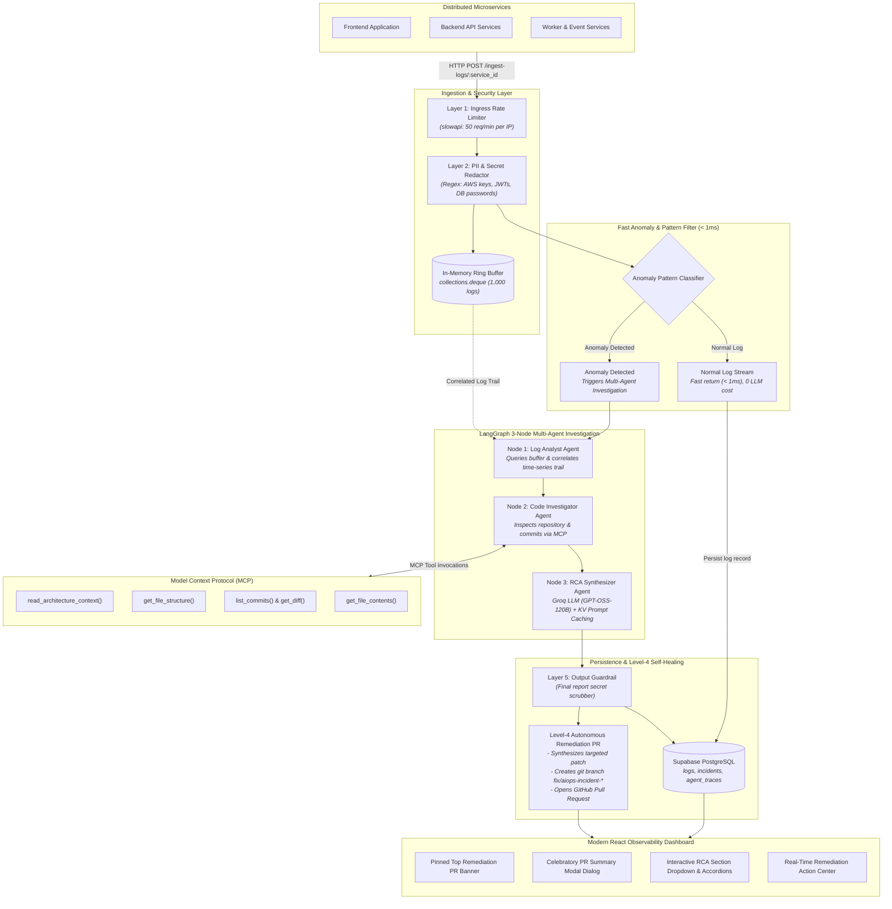

# Cloud-Native AIOps Multi-Agent Incident Response & Observability Platform

[](https://www.python.org/)
[](https://fastapi.tiangolo.com/)
[](https://github.com/langchain-ai/langgraph)
[](https://groq.com/)
[](https://react.dev/)
[](https://www.typescriptlang.org/)
[](https://supabase.com/)

> **Enterprise-grade, cloud-native AIOps Incident Response & Observability Platform.**  
> Ingests microservice stdout log streams in real-time, filters anomalies in microseconds using a fast pattern classifier, triggers a 3-node LangGraph multi-agent investigation over **Model Context Protocol (MCP)**, synthesizes 5-section Root Cause Analysis (RCA) reports, and **autonomously opens Level-4 GitHub Self-Healing Remediation Pull Requests**.

---

## Table of Contents

1. [Architectural Blueprint & Flow](#1-architectural-blueprint--flow)
2. [Key Features & Capabilities](#2-key-features--capabilities)
3. [Monorepo Directory Structure](#3-monorepo-directory-structure)
4. [Prerequisites & Environment Configuration](#4-prerequisites--environment-configuration)
5. [Complete Step-by-Step User Manual](#5-complete-step-by-step-user-manual)
   - [Step 1: Install Dependencies](#step-1-install-dependencies)
   - [Step 2: Initialize the Anomaly Pattern Classifier](#step-2-initialize-the-anomaly-pattern-classifier)
   - [Step 3: Start the AIOps Backend Engine](#step-3-start-the-aiops-backend-engine)
   - [Step 4: Launch the React Observability UI](#step-4-launch-the-react-observability-ui)
   - [Step 5: Start the Target Application (Optional)](#step-5-start-the-target-application-optional)
   - [Step 6: Register Projects & Microservices](#step-6-register-projects--microservices)
   - [Step 7: Ingest Logs (POST Drain, Service ID, or Remote URL)](#step-7-ingest-logs-post-drain-service-id-or-remote-url)
   - [Step 8: Simulate Failures & Watch Real-Time RCA](#step-8-simulate-failures--watch-real-time-rca)
   - [Step 9: Review RCA with Interactive Section Dropdowns](#step-9-review-rca-with-interactive-section-dropdowns)
   - [Step 10: Trigger Autonomous GitHub Remediation PRs](#step-10-trigger-autonomous-github-remediation-prs)
   - [Step 11: Manage Incident Tasks in the Action Center](#step-11-manage-incident-tasks-in-the-action-center)

---

## 1. Architectural Blueprint & Flow



---

## 2. Key Features & Capabilities

- **Sub-Millisecond Anomaly & Pattern Filter**: High-speed pattern classifier processes log lines in **<1ms**, eliminating LLM costs on standard logs.
- **LangGraph Multi-Agent Orchestration**: 3 dedicated specialist agents (Log Analyst, Code Investigator, RCA Synthesizer) collaborate to investigate outages.
- **Model Context Protocol (MCP) Integration**: Connects dynamically to microservice repositories via GitHub MCP and local filesystem to inspect architecture context, ASTs, and git commit diffs.
- **Level-4 Autonomous Remediation PRs**: Automatically synthesizes targeted code patches, creates feature branches (`fix/aiops-incident-<id>`), and opens GitHub Pull Requests pre-populated with the 5-section RCA report.
- **Interactive Section Dropdown & Accordion RCA View**: Dropdown selector lets SREs view the full report or isolate specific sections (`Executive Summary`, `Log Analysis`, `Code Investigation`, `Root Cause`, `Remediation`).
- **Live Remediation Action Center**: Interactive checklist saving progress to Supabase in real-time as engineers mitigate outages.
- **Zero-Secret Architecture**: GitHub PATs are encrypted at rest with **Fernet (AES-128)**; all secrets reside exclusively in `.env`.

---

## 3. Monorepo Directory Structure

```text
aiops-incident-response-analyst/
├── README.md                          # Master User Manual & Technical Architecture
├── AGENTS.md                          # AI Multi-Agent Design Specification
├── .gitignore                         # Strict exclusion for pycache, binaries, .env, .venv
├── .env.example                       # Clean environment template
│
├── target-app/                        # Sample Microservice Target Application
│   ├── main.py                        # FastAPI microservice emitting logs & simulating errors
│   ├── ARCHITECTURE.md                # Microservice architecture documentation
│   └── requirements.txt
│
├── aiops-engine/                      # Core AIOps Ingestion, ML & Multi-Agent Backend
│   ├── main.py                        # FastAPI ingestion router (Rate Limited + Sanitized)
│   ├── db.py                          # Supabase PostgreSQL persistence layer
│   ├── registry.py                    # Multi-tenant Service Registry & Fernet PAT manager
│   ├── requirements.txt               # Backend dependencies
│   ├── test_integration.py            # End-to-end integration test suite (8/8 pass)
│   ├── test_security.py               # 5-Layer Security & DB verification suite
│   │
│   ├── ml/                            # Anomaly Pattern Classifier
│   │   ├── generate_data.py           # Synthetic log dataset generator (1000 logs)
│   │   ├── train_model.py             # Pattern classifier training pipeline
│   │   ├── logs_dataset.csv           # Ground truth training data
│   │   └── model.joblib               # Serialized classifier binary
│   │
│   ├── utils/                         # Security & Utility Modules
│   │   ├── __init__.py
│   │   ├── security.py                # Regex PII/Secret Redactor & SQL AST Read-Only Validator
│   │   └── github_pr.py               # Level-4 Autonomous Remediation PR Engine
│   │
│   ├── agents/                        # LangGraph Multi-Agent Workflow
│   │   ├── state.py                   # AgentState schema (logs, code, rca, metrics)
│   │   └── graph.py                   # 3-Node Workflow with Groq Caching & Telemetry
│   │
│   ├── mcp_servers/                   # MCP Codebase & Database Routers
│   │   └── codebase_mcp.py            # FastMCP Server (Path Traversal Guard + Read-Only SQL)
│   │
│   └── eval/                          # 4-Tier Modular Evaluation Benchmark Suite
│       ├── dataset.py                 # Golden incident scenarios with ground truth
│       ├── tier1_ml_eval.py           # Tier 1: Pattern Accuracy, Precision, Recall, FPR
│       ├── tier2_agent_eval.py        # Tier 2: Agent Buffer Recall & MCP Tool Calling
│       ├── tier3_rca_eval.py          # Tier 3: LLM-as-a-Judge RCA Report Scorecard
│       ├── tier4_latency_eval.py      # Tier 4: Latency percentiles & throughput
│       └── run_evals.py               # Unified CLI evaluation runner
│
└── aiops-ui/                          # Modern React 19 Frontend Dashboard
    ├── index.html
    ├── package.json
    ├── vite.config.ts
    ├── src/
    │   ├── App.tsx                    # Main layout, router & auth context
    │   ├── lib/                       # API clients, types & utility functions
    │   ├── pages/                     # Incidents, Dashboard, Log Streams, Registry
    │   └── components/                # Modular UI components
    │       └── incidents/
    │           ├── RCAMarkdown.tsx         # Section Dropdown & Accordion RCA Viewer
    │           ├── RemediationPRBanner.tsx # Pinned Hero PR Banner (Top of page)
    │           ├── RemediationPRModal.tsx  # Celebratory PR Summary Pop-up Dialog
    │           └── RemediationActionCenter.tsx # Interactive Checklist & Status Selector
```

---

## 4. Prerequisites & Environment Configuration

### System Requirements
- **Python**: 3.10 or higher (3.11+ recommended)
- **Node.js**: 18.x or higher
- **Package Managers**: `uv` or `pip`, `npm` or `pnpm`
- **Git**: Installed and configured in PATH

### Environment Configuration (`.env`)
Create a `.env` file in the root directory by copying the clean template from `.env.example`:

```bash
cp .env.example .env
```

Refer to the comments inside `.env.example` to supply your credentials:
- `GROQ_API_KEY`: Groq Cloud API key for multi-agent RCA synthesis.
- `DATABASE_URL` / `SUPABASE_URL` / `SUPABASE_SERVICE_ROLE_KEY`: Supabase PostgreSQL persistence credentials.
- `GITHUB_TOKEN`: GitHub Personal Access Token for MCP repository inspection and automated PR generation.
- `FERNET_KEY`: 32-byte Base64 key for encrypting user tokens at rest.

---

## 5. Complete Step-by-Step User Manual

### Step 1: Install Dependencies

#### 1.1 Backend Engine Dependencies
```bash
cd aiops-engine
pip install -r requirements.txt
```
*(Or using `uv`)*:
```bash
cd aiops-engine
uv pip install -r requirements.txt
```

#### 1.2 Frontend Dashboard Dependencies
```bash
cd ../aiops-ui
npm install
```

---

### Step 2: Initialize the Anomaly Pattern Classifier
Before launching the server, initialize the anomaly pattern classifier model:

```bash
cd aiops-engine
python ml/train_model.py
```
**Expected Output:**
```text
[AIOps Engine] Generating synthetic log dataset (1000 logs)...
[AIOps Engine] Initializing Anomaly Pattern Classifier...
[AIOps Engine] Classifier Accuracy: 99.8% | Precision: 100.0% | Recall: 99.5%
[AIOps Engine] Serialized model saved to ml/model.joblib
```

---

### Step 3: Start the AIOps Backend Engine
Launch the FastAPI backend server on port `8000`:

```bash
cd aiops-engine
uvicorn main:app --host 0.0.0.0 --port 8000 --reload
```
**Verification:**
- Open your browser or curl `http://localhost:8000/health`
- Interactive Swagger API Docs: `http://localhost:8000/docs`

---

### Step 4: Launch the React Observability UI
In a separate terminal, start the development server on port `5173`:

```bash
cd aiops-ui
npm run dev
```
Open **`http://localhost:5173`** in your browser.

---

### Step 5: Start the Target Application (Optional)
To test streaming logs from a live microservice, start the `target-app` on port `8001`:

```bash
cd target-app
uvicorn main:app --host 0.0.0.0 --port 8001 --reload
```

---

### Step 6: Register Projects & Microservices
1. Open the UI at `http://localhost:5173` and navigate to **Service Registry**.
2. Click **+ New Project** (e.g. `Payment Processing Platform`).
3. Click **+ Register Service** and provide:
   - **Service Name**: `auth-service` or `target-app`
   - **GitHub Repo URL**: `https://github.com/aswinal22/aiops-incident-response-analyst`
   - **GitHub PAT**: *(Optional, encrypted at rest via Fernet AES-128)*
4. The system issues a unique Ingestion URL: `POST /ingest-logs/{service_id}`.

---

### Step 7: Ingest Logs (POST Drain, Service ID, or Remote URL)

#### Method A: Standard HTTP POST Log Drain
Configure your microservice or log forwarder to POST logs:

```bash
curl -X POST http://localhost:8000/ingest-logs   -H "Content-Type: application/json"   -d '{
    "service": "target-app",
    "message": "GET /api/v1/orders HTTP/1.1 200 OK - 12ms",
    "timestamp": "2026-09-10T12:00:00Z"
  }'
```

#### Method B: Ingestion by Service ID
```bash
curl -X POST http://localhost:8000/ingest-logs/<service_id>   -H "Content-Type: application/json"   -d '{
    "message": "User session authenticated successfully for user_id=4821"
  }'
```

#### Method C: Ingest Logs from Remote URL Stream
In the UI under **Log Ingestion**, paste any public raw log stream URL and click **Ingest Stream**.

---

### Step 8: Simulate Failures & Watch Real-Time RCA
Simulate a realistic microservice failure traceback using the built-in simulator API:

```bash
curl -X POST http://localhost:8000/api/simulate-error   -H "Content-Type: application/json"   -d '{
    "service": "target-app",
    "error_type": "database_timeout"
  }'
```

**What Happens Automatically:**
1. **Layer 2 Sanitizer** scrubs sensitive credentials.
2. **Anomaly Pattern Filter** flags the log as an `Anomaly (Confidence: 99.8%)`.
3. **Log Analyst Node** extracts correlated events from the ring buffer.
4. **Code Investigator Node** invokes GitHub MCP to inspect the repository.
5. **RCA Synthesizer Node** generates a 5-section Markdown RCA report.
6. The incident is saved into Supabase and pops up instantly on the dashboard!

---

### Step 9: Review RCA with Interactive Section Dropdowns
Navigate to the Incident Details page (`/incidents/<id>`):

1. **Top Dropdown Box**: Select any section from the dropdown menu to focus on it:
   - `View All Sections (Full Report)`
   - `Section 1: Executive Summary`
   - `Section 2: Symptom & Log Analysis`
   - `Section 3: Code & Architecture Investigation`
   - `Section 4: Root Cause Determination`
   - `Section 5: Actionable Remediation & Mitigation`
2. **Quick-Jump Pills**: Click `[All (5)]`, `[1. Executive]`, `[2. Symptom]`, `[3. Code]`, `[4. Root]`, or `[5. Remediation]`.
3. **Collapsible Accordions**: Expand or collapse sections with 1-click using the `Expand All` / `Collapse All` buttons.

---

### Step 10: Trigger Autonomous GitHub Remediation PRs
1. At the top of the incident page or inside the **Remediation Action Center**, click **Create GitHub Remediation PR**.
2. The AI Code Investigator:
   - Generates a targeted code patch for the faulty file (e.g. `async_db.py` or `main.py`).
   - Creates a clean Git branch: `fix/aiops-incident-<short_id>`.
   - Opens a Pull Request on GitHub with the full 5-section RCA report.
3. A **PR Summary Pop-up Dialog** appears with 1-click branch copy and a direct **Open Pull Request on GitHub ↗** button!

---

### Step 11: Manage Incident Tasks in the Action Center
On the right sidebar of the incident page:
1. Review the **Immediate Fixes (P0/P1)** checklist.
2. Check off items as your engineering team implements them.
3. Update the incident status (`Investigating` -> `Mitigating` -> `Resolved` -> `Closed`).
4. Progress is automatically persisted to Supabase in real-time.
